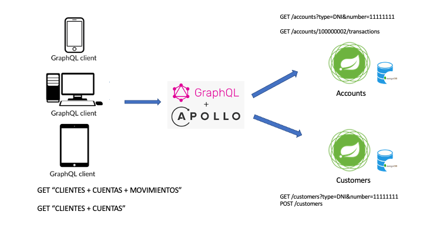

# GraphQL - Server



## 0 Startup
```shell
docker compose -f ./deploy/compose/docker-compose.yml up
```

## 1 Querys, Mutation y Subscription

### Parámetros:

* Server: http://localhost:3001/graphql

### Q1: Listar cuentas por tipo y número de documento
```GraphQL
query {
  accounts(data: { documentType: DNI, documentNumber: "11111111" }) {
    id
    number
    currency
    amount
  }
}
```

### Q2: Listar cuentas + transacciones por tipo y número de documento
```GraphQL
query {
  accounts(data: { documentType: DNI, documentNumber: "11111111" }) {
    id
    number
    currency
    amount
    transactions {
      id
      type
      amount
      amount
    }
  }
}

```

### Q3: Listar clientes, con cuentas y movimientos
```GraphQL
query {
  customers {
    id
    name
    accounts {
      id
      number
      transactions {
        id
        type
        amount
      }
    }
  }
}
```

### M1: Mutation - Crear cliente
```GraphQL
mutation {
  createCustomer(
    data: {
      name: "Juan1"
      lastName: "Perez"
      createAt: "2021-06-30"
      documentType: DNI
      documentNumber: "12345678"
    }
  ) {
    name
    id
    lastName
    documentType
  }
}
```

### S1: Subcription - Crear cliente
```GraphQL
subscription {
  customerChanged {
    id
    name
    lastName
  }
}
```

## 2 Microservices

Nombre | Descripción
------------- | -------------
ms-config  | Configuration server
ms-accounts  | Microservicer accounts
ms-customers  | Microservicer customers
ms-graphql | GraphQL - Apollo Server

### 2.1 Endpoints
Microservice  | Descripción  | Endpoint
------------- | ------------- | -------------
Accounts | Listar cuentas de un cliente| GET /accounts?type=DNI&number=11111111
Accounts | Listar transacciones por cuenta| GET accounts/\<accountId>/transactions
Customers | Listar clientes| GET /customers
Customers | Listar clientes| GET /customers/DNI/11111112

### 2.2 Data

#### Customers

DocumentType  | DocumentNumber  | LastName | FirstName
------------- | ------------- | -------------| -------------
DNI|11111111|Messi|Lionel
DNI|11111112|Ronaldo|Cristiano
DNI|11111113|Emape|Gillian

#### Accounts

DocumentType  | DocumentNumber  | Número | Moneda
------------- | ------------- | -------------| -------------
DNI|11111111|100000001|1001
DNI|11111111|100000002|1000
DNI|11111112|100000003|1001
DNI|11111113|100000004|1001

### Configuration server


https://github.com/mzegarras/ms-configuration


## Siguientes ejemplos
* Authorization server
* Validación de cors
* JWT